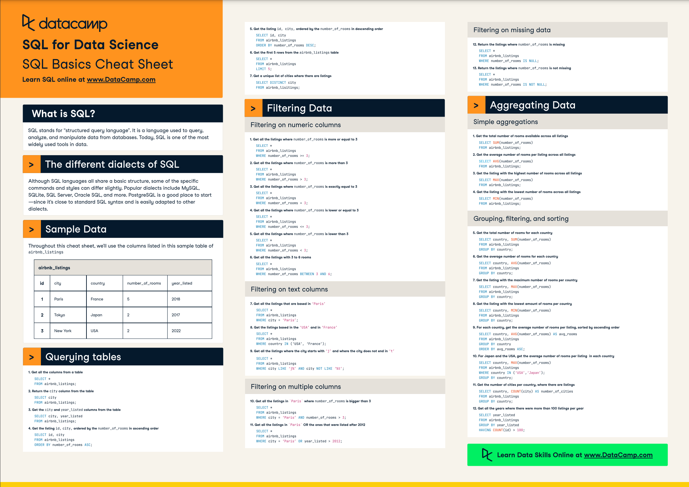
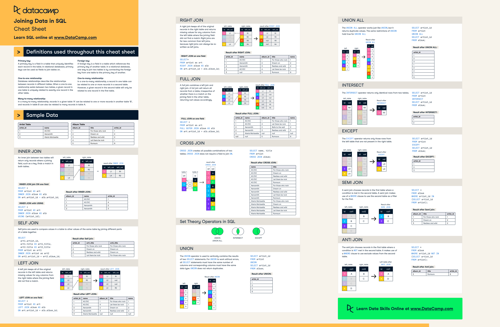

# SQL Revision
This project is dedicated to mastering SQL querying techniques. Here, I'll be sharing valuable insights and practical tips to help enhance SQL skills. This repo is meant for personal development to level up my querying game but feel free to contribute if you like the techniques and pace.

Start by understanding the basics through theoretical courses. SQL Introduction form [W3 Schools](https://www.w3schools.com/sql/sql_intro.asp) and SQL fundamentals from [DataCamp](https://app.datacamp.com/learn/skill-tracks/sql-fundamentals) come in handy. 

#### These cheatsheets from Datacamp provide a quick glance:
**Basics:**

**Joins:**


* * * 
#### Practices:

1. To query for a range of records:
```
-- Display all columns of a table where the <column_name> is between 5 and 10
SELECT * 
FROM <Table>
WHERE <column_name> BETWEEN 5 AND 10
```
<br>

2. To query for specific columns:
```
-- Create a list with the required matches to check with the <column_name>
SELECT * 
FROM <table>
WHERE <column> in ('Value1','Value2',...)
```
<br>

3. To query results which match a pattern:
Using `LIKE` and  `NOT LIKE` to check patterns using `%` and `_`
```
SELECT * 
FROM <table>
where <column> LIKE '%d' AND NOT LIKE '_a%'
-- Queries results which end with 'd' and doesn't have 2nd letter as 'a'
```
<br>

4. Condition while Grouping:
`GROUP BY` uses `HAVING` over `WHERE` to add a grouping condition on the query
```
-- Display years which have more than 100 entries
SELECT year
FROM <table>
GROUP BY year
HAVING COUNT(<primary_key>)>100

```
<br>

5. Using a queries result as a condition:
Using `IN` and `NOT IN` to match the query. 
```
SELECT *
FROM <table>
where <column> IN 
    (
        -- Another Query
        SELECT <column2> FROM <table2>
    )
```
<br>

6. Finding the data difference form a data format column:
Use the function `datadiff()`
```
select w2.id
from weather as w1
join weather as w2
where datediff(w2.recordDate, w1.recordDate)=1
-- Finding all the dates from the table 2, where the difference in dates of table 1 is 1
```
<br>

7. To round a column to nearest whole number or specific deminal places:
Use the function `round()`. Specify the number of decimals in the function as a second parameter. 
```
SELECT round(max(<column>,2))
FROM <table>
-- Prints the maximum of a column and rounds it to nearest value to 2 decimal places. 
```
<br>

8. Using if to query enums:
```
select avg(if(actions='confirmed',1,0)) as confirmation
from <table>
-- Finds average confirmed actions in the table
```
<br>

9. Calculate price per unit:
Example: [Average Selling Price](https://github.com/abhinavpannala/SQL-Practice/tree/main/1390-average-selling-price)
```
-- avg() can only be used to perform calculations on field level.
select sum(s.price*p.unit)/sum(p.unit)
from <table> as s 
join <table> as p
```
<br>

10. Date Formats:
Use date_format function to convert a date to as string, which matches given format_string
    **Year:**
    YYYY or yyyy: Four-digit year (e.g., 2023).
    YY or yy: Last two digits of the year (e.g., 23 for 2023).
    **Month:**
    MM or mm: Two-digit month (01 for January, 12 for December).
    Month or month: Full month name (e.g., January, February).
    **Day:**
    DD or dd: Two-digit day of the month (01 to 31).
    D or d: Day of the week (1 for Sunday, 7 for Saturday).
    **Hour:**
    HH: Two-digit hour in 24-hour format (00 to 23).
    hh: Two-digit hour in 12-hour format (01 to 12).
    **Minutes and Seconds:**
    MI or mi: Two-digit minutes (00 to 59).
    SS or ss: Two-digit seconds (00 to 59).
    **Milliseconds:**
    MS or ms: Milliseconds (000 to 999).
    **Timezone:**
    TZD or tzd: Timezone abbreviation (e.g., PST, GMT).
    TZO or tzo: Timezone offset in hours and minutes (e.g., +05:30).
    **Miscellaneous:**
    DOW or dow: Abbreviated day of the week (e.g., Sun, Mon).
    DOY or doy: Day of the year (001 to 366).
    W or w: Week of the year (1 to 52).
```
SELECT DATE_FORMAT(<date>, '%Y-%m-%d %H:%i:%s') AS formatted_date
from <table>;
-- Converts the date column to match the format string. 
```
<br>

11. Substraction on Date:
DATE_SUB can be used to subject a specific unit time from the given date. 
It can be used to check the date match in SQL
Example: [game-play-analysis-iv](https://github.com/abhinavpannala/SQL-Practice/commit/ec3f2a2f3af0ce1f701953c2448327485dd3858e)
Understand how the function can be used to optimize the query
```
SELECT DATE_SUB('2023-11-15', INTERVAL EXPRESSION UNIT) as datesub
from <table>;
-- Expression is the number
-- Unit can be day, hour, month, year
```


****
#### Insights:
1. End values are inclusive in `BETWEEN <start_value> AND <end_value>`
